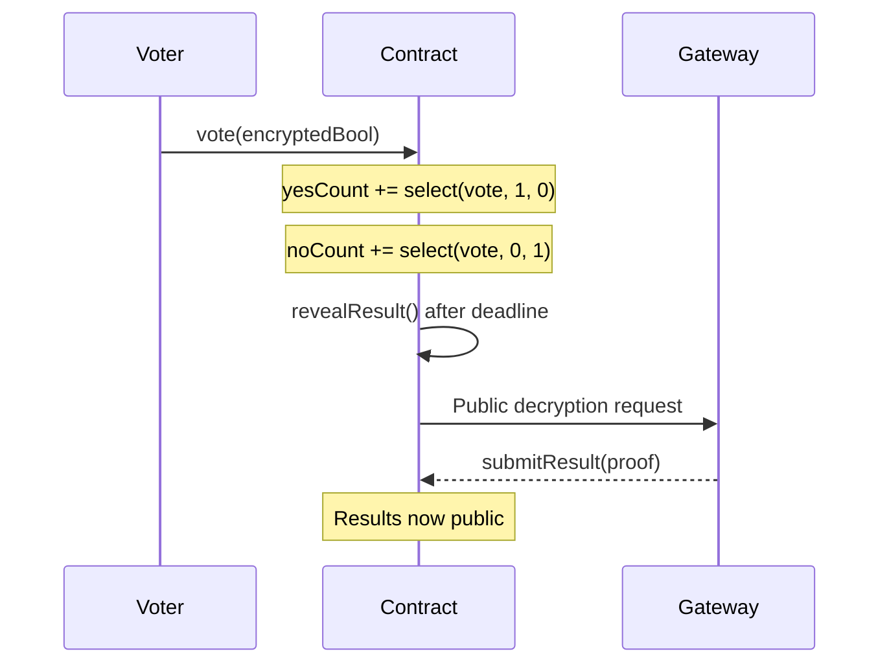

# Confidential Voting

> Secret ballot voting where individual votes remain encrypted until the end

## Overview

This example demonstrates how to implement **Confidential Voting** using FHEVM.

| Property | Value |
|----------|-------|
| **Level** | 🟡 Intermediate |
| **Category** | applications |
| **Key** | `confidential-voting` |

## 🗳️ Secret Ballot Voting

Votes remain encrypted until the voting period ends:



## 🔐 Privacy Guarantees

- Individual votes are **never revealed**
- Only the **final tally** is decrypted
- No one can see vote distribution during voting

## 🧠 Key FHE Concepts Used

- `FHE.select for vote counting`
- `makePubliclyDecryptable for reveal`
- `checkSignatures for proof verification`

## 📝 Contract Implementation

`contracts/ConfidentialVoting.sol`

```solidity
// SPDX-License-Identifier: BSD-3-Clause-Clear
pragma solidity ^0.8.24;

import "@fhevm/solidity/lib/FHE.sol";
import "encrypted-types/EncryptedTypes.sol";
import { ZamaEthereumConfig } from "@fhevm/solidity/config/ZamaConfig.sol";
import "@openzeppelin/contracts/access/Ownable.sol";

contract ConfidentialVoting is Ownable, ZamaEthereumConfig {
    struct Proposal {
        string description;
        uint256 endTime;
        euint64 yesCount; // Encrypted count of YES votes
        euint64 noCount;  // Encrypted count of NO votes
        bool exists;
        bool revealed;
        uint64 decryptedYes;
        uint64 decryptedNo;
    }

    mapping(uint256 => Proposal) public proposals;
    uint256 public proposalCount;

    // track if user has voted on a proposal: proposalId => user => bool
    mapping(uint256 => mapping(address => bool)) public hasVoted;

    event ProposalCreated(uint256 indexed proposalId, string description, uint256 endTime);
    event VoteCast(uint256 indexed proposalId, address indexed voter);
    event RevealRequested(uint256 indexed proposalId);
    event ResultRevealed(uint256 indexed proposalId, uint64 yesVotes, uint64 noVotes);

    constructor() Ownable(msg.sender) {}

    function createProposal(string memory _description, uint256 _duration) public onlyOwner {
        proposalCount++;
        Proposal storage p = proposals[proposalCount];
        p.description = _description;
        p.endTime = block.timestamp + _duration;
        p.exists = true;
        
        // Initialize encrypted counters to 0
        p.yesCount = FHE.asEuint64(0);
        p.noCount = FHE.asEuint64(0);

        emit ProposalCreated(proposalCount, _description, p.endTime);
    }

    function vote(uint256 _proposalId, externalEbool _encryptedVote, bytes calldata _inputProof) public {
        Proposal storage p = proposals[_proposalId];
        require(p.exists, "Proposal does not exist");
        require(block.timestamp < p.endTime, "Voting period has ended");
        require(!hasVoted[_proposalId][msg.sender], "You have already voted");

        // Validate the encrypted input is from msg.sender and bound to this contract
        ebool userVote = FHE.fromExternal(_encryptedVote, _inputProof);
        FHE.allowThis(userVote); 
        // Note: verifyVote isn't a standard FHE function in some versions, usually we use FHE.asEbool with proof or just rely on modifier.
        // Let's stick to standard pattern: simply using the input.
        
        // Standard pattern: 
        // ebool userVote = FHE.asEbool(_encryptedVote, _inputProof); // verification happens here
        
        // However, in latest fhevm, we usually pass the raw ciphertext handles or bytes.
        // Let's assume input is ebool directly from params which usually implies prior sanitization if strictly typed, 
        // but typically in these examples we pass ciphertext and proof.
        
        // Actually, for this example hub which uses latest fhevm, the best practice is:
        // Function takes `ebool` and `bytes inputProof`.
        // We ensure `ebool` is valid.
        
        // Check input proof
        // Note: TFHE.allow is not needed for inputs processed immediately.
        
        // Convert boolean vote to integer for counting
        // If vote is true (YES), add 1 to yesCount, 0 to noCount
        // If vote is false (NO), add 0 to yesCount, 1 to noCount
        
        euint64 castYes = FHE.select(userVote, FHE.asEuint64(1), FHE.asEuint64(0));
        euint64 castNo = FHE.select(userVote, FHE.asEuint64(0), FHE.asEuint64(1));
        
        // Update proposal counters
        p.yesCount = FHE.add(p.yesCount, castYes);
        p.noCount = FHE.add(p.noCount, castNo);
        FHE.allowThis(p.yesCount);
        FHE.allowThis(p.noCount);
        
        // Mark as voted
        hasVoted[_proposalId][msg.sender] = true;
        
        // We must allow the contract to operate on these new handles? 
        // No, FHE.add automatically handles it.
        // But we might want to allow the owner or everyone to decrypt the result later.
        // For now, we keep them internal until reveal.
        
        // To allow anyone to decrypt the result later, we will use FHE.allow in revealResult.
        
        emit VoteCast(_proposalId, msg.sender);
    }

    function revealResult(uint256 _proposalId) public {
        Proposal storage p = proposals[_proposalId];
        require(p.exists, "Proposal does not exist");
        require(block.timestamp >= p.endTime, "Voting period not ended");
        require(!p.revealed, "Result already revealed");

        FHE.makePubliclyDecryptable(p.yesCount);
        FHE.makePubliclyDecryptable(p.noCount);

        emit RevealRequested(_proposalId);
    }

    function submitResult(
        uint256 _proposalId,
        bytes memory yesClear,
        bytes memory yesProof,
        bytes memory noClear,
        bytes memory noProof
    ) public {
        Proposal storage p = proposals[_proposalId];
        require(p.exists, "Proposal does not exist");
        require(!p.revealed, "Result already revealed");
        
        // Verify Yes
        bytes32[] memory handlesYes = new bytes32[](1);
        handlesYes[0] = FHE.toBytes32(p.yesCount);
        FHE.checkSignatures(handlesYes, yesClear, yesProof);
        p.decryptedYes = abi.decode(yesClear, (uint64));

        // Verify No
        bytes32[] memory handlesNo = new bytes32[](1);
        handlesNo[0] = FHE.toBytes32(p.noCount);
        FHE.checkSignatures(handlesNo, noClear, noProof);
        p.decryptedNo = abi.decode(noClear, (uint64));

        p.revealed = true;

        emit ResultRevealed(_proposalId, p.decryptedYes, p.decryptedNo);
    }
}

```

## 🧪 Test Suite

`test/ConfidentialVoting.ts`

```typescript
import { expect } from "chai";
import { ethers, fhevm } from "hardhat";
import { ConfidentialVoting } from "../../types";
import { HardhatEthersSigner } from "@nomicfoundation/hardhat-ethers/signers";

describe("ConfidentialVoting", function () {
    let contract: ConfidentialVoting;
    let contractAddress: string;
    let signers: { deployer: HardhatEthersSigner; alice: HardhatEthersSigner; bob: HardhatEthersSigner; carol: HardhatEthersSigner };

    before(async function () {
        const ethSigners = await ethers.getSigners();
        signers = {
            deployer: ethSigners[0],
            alice: ethSigners[1],
            bob: ethSigners[2],
            carol: ethSigners[3],
        };
    });

    beforeEach(async function () {
        // Check if running on mock environment
        if (!fhevm.isMock) {
            console.warn(`This hardhat test suite cannot run on Sepolia Testnet`);
            this.skip();
        }

        const factory = await ethers.getContractFactory("ConfidentialVoting");
        // @ts-ignore
        contract = (await factory.deploy()) as ConfidentialVoting;
        contractAddress = await contract.getAddress();
    });

    it("should create a proposal and accept encrypted votes", async function () {
        // 1. Create Proposal (Duration: 1 hour)
        const duration = 3600;
        const tx = await contract.createProposal("Should we adopt FHE?", duration);
        await tx.wait();

        const proposalId = 1;
        const proposal = await contract.proposals(proposalId);
        expect(proposal.description).to.equal("Should we adopt FHE?");
        expect(proposal.exists).to.be.true;

        // 2. Cast Votes
        // Voter 1 (Alice): YES (true)
        const voteYesAlice = await fhevm.createEncryptedInput(contractAddress, signers.alice.address)
            .addBool(true)
            .encrypt();

        await contract.connect(signers.alice).vote(
            proposalId,
            voteYesAlice.handles[0],
            voteYesAlice.inputProof
        );

        // Voter 2 (Bob): NO (false)
        const voteNoBob = await fhevm.createEncryptedInput(contractAddress, signers.bob.address)
            .addBool(false)
            .encrypt();

        await contract.connect(signers.bob).vote(
            proposalId,
            voteNoBob.handles[0],
            voteNoBob.inputProof
        );

        // Voter 3 (Carol): YES (true)
        const voteYesCarol = await fhevm.createEncryptedInput(contractAddress, signers.carol.address)
            .addBool(true)
            .encrypt();

        await contract.connect(signers.carol).vote(
            proposalId,
            voteYesCarol.handles[0],
            voteYesCarol.inputProof
        );

        // 3. Try to reveal before deadline (Should fail)
        await expect(contract.revealResult(proposalId)).to.be.revertedWith("Voting period not ended");

        // 4. Fast forward time
        // Increase time by duration + 1 second
        await ethers.provider.send("evm_increaseTime", [duration + 1]);
        await ethers.provider.send("evm_mine", []);

        // 5. Reveal Result
        // 5. Reveal Result
        const revealTx = await contract.revealResult(proposalId);
        await revealTx.wait();

        const p = await contract.proposals(proposalId);
        const yesResult = await fhevm.publicDecrypt([p.yesCount]);
        const noResult = await fhevm.publicDecrypt([p.noCount]);

        const submitTx = await contract.submitResult(
            proposalId,
            yesResult.abiEncodedClearValues,
            yesResult.decryptionProof,
            noResult.abiEncodedClearValues,
            noResult.decryptionProof
        );
        await submitTx.wait();

        const updatedProposal = await contract.proposals(proposalId);
        expect(updatedProposal.revealed).to.be.true;
        expect(updatedProposal.decryptedYes).to.equal(2); // Alice + Carol
        expect(updatedProposal.decryptedNo).to.equal(1);  // Bob
    });

    it("should prevent double voting", async function () {
        await contract.createProposal("Double Vote Test", 3600);
        const proposalId = 1;

        const vote = await fhevm.createEncryptedInput(contractAddress, signers.alice.address)
            .addBool(true)
            .encrypt();

        await contract.connect(signers.alice).vote(proposalId, vote.handles[0], vote.inputProof);

        // Try again 
        await expect(
            contract.connect(signers.alice).vote(proposalId, vote.handles[0], vote.inputProof)
        ).to.be.revertedWith("You have already voted");
    });
});

```

## 🚀 Quick Start

Generate this example locally:

```bash
# Using npx (no install)
npx jobjab-fhevm-examples confidential-voting ./my-confidential-voting

# Or with the CLI
npm run create confidential-voting ./my-confidential-voting
```

Then build and test:

```bash
cd ./my-confidential-voting
npm install
npm run compile
npm run test
```

---
*Generated by FHEVM Example Hub*
