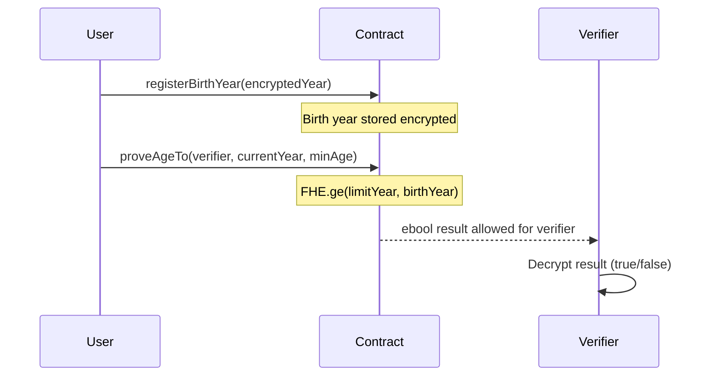

# Private Age Verification

> Verify age without revealing birthdate using FHE

## Overview

This example demonstrates how to implement **Private Age Verification** using FHEVM.

| Property | Value |
|----------|-------|
| **Level** | 🟡 Intermediate |
| **Category** | applications |
| **Key** | `private-age-verification` |

## 🔐 Privacy-Preserving Identity

This example shows how to prove statements about encrypted data without revealing the underlying value.

**Use Case:** Prove you are over 18 without revealing your exact birthdate.

## 📊 Verification Flow



## 💡 Key Insight

The verifier only learns **true or false** - never the actual birth year.

## 🧠 Key FHE Concepts Used

- `FHE.ge for encrypted comparisons`
- `FHE.allow for selective disclosure`
- `Zero-knowledge-like proofs with FHE`

## 📝 Contract Implementation

`contracts/PrivateAgeVerification.sol`

```solidity
// SPDX-License-Identifier: BSD-3-Clause-Clear
pragma solidity ^0.8.24;

import "@fhevm/solidity/lib/FHE.sol";
import "encrypted-types/EncryptedTypes.sol";
import { ZamaEthereumConfig } from "@fhevm/solidity/config/ZamaConfig.sol";

contract PrivateAgeVerification is ZamaEthereumConfig {
    address public owner;

    modifier onlyOwner() {
        require(msg.sender == owner, "Not owner");
        _;
    }

    // Encrypted storage of user birth years
    mapping(address => euint32) private userBirthYears;
    mapping(address => bool) public isRegistered;
    
    constructor() {
        owner = msg.sender;
    }

    function registerBirthYear(externalEuint32 _encryptedBirthYear, bytes calldata _inputProof) public {
        userBirthYears[msg.sender] = FHE.fromExternal(_encryptedBirthYear, _inputProof);
        isRegistered[msg.sender] = true;
        
        FHE.allowThis(userBirthYears[msg.sender]);
        FHE.allow(userBirthYears[msg.sender], msg.sender);
    }

    // Returns an encrypted boolean indicating if the user is older than _minAge
    // We calculate age as: CurrentYear - BirthYear >= MinAge
    // <=> CurrentYear - MinAge >= BirthYear
    function isOverAge(uint256 _currentYear, uint32 _minAge) public returns (ebool) {
        require(isRegistered[msg.sender], "User not registered");
        
        // ageLimitYear = CurrentYear - MinAge
        // User must be born on or before this year.
        uint32 ageLimitYear = uint32(_currentYear - _minAge);
        
        // We check: ageLimitYear >= BirthYear
        ebool isOlder = FHE.ge(FHE.asEuint32(ageLimitYear), userBirthYears[msg.sender]);
        
        return isOlder;
    }
    
    // Non-view function to generate and share proof
    function proveAgeTo(address _verifier, uint256 _currentYear, uint32 _minAge) public {
        require(isRegistered[msg.sender], "User not registered");

        uint32 ageLimitYear = uint32(_currentYear - _minAge);
        ebool isOlder = FHE.ge(FHE.asEuint32(ageLimitYear), userBirthYears[msg.sender]);

        FHE.allow(isOlder, _verifier);
        FHE.allow(isOlder, msg.sender);
    }
}

```

## 🧪 Test Suite

`test/PrivateAgeVerification.ts`

```typescript
import { expect } from "chai";
import { ethers, fhevm } from "hardhat";
import { PrivateAgeVerification } from "../../types";
import { HardhatEthersSigner } from "@nomicfoundation/hardhat-ethers/signers";

describe("PrivateAgeVerification", function () {
    let contract: PrivateAgeVerification;
    let contractAddress: string;
    let signers: { deployer: HardhatEthersSigner; alice: HardhatEthersSigner; verifier: HardhatEthersSigner };

    before(async function () {
        const ethSigners = await ethers.getSigners();
        signers = {
            deployer: ethSigners[0],
            alice: ethSigners[1],
            verifier: ethSigners[2],
        };
    });

    beforeEach(async function () {
        if (!fhevm.isMock) {
            this.skip();
        }
        const factory = await ethers.getContractFactory("PrivateAgeVerification");
        contract = (await factory.deploy()) as PrivateAgeVerification;
        contractAddress = await contract.getAddress();
    });

    it("should allow Alice to prove she is over 18", async function () {
        // 1. Register Birth Year (e.g., 2000)
        const birthYear = 2000;
        const currentYear = 2024;
        const minAge = 18;

        const encBirthYear = await fhevm.createEncryptedInput(contractAddress, signers.alice.address)
            .add32(birthYear)
            .encrypt();

        await contract.connect(signers.alice).registerBirthYear(
            encBirthYear.handles[0],
            encBirthYear.inputProof
        );

        // 2. Prove to Verifier
        // We expect Alice (24 years old) to be > 18
        const txProve = await contract.connect(signers.alice).proveAgeTo(
            signers.verifier.address,
            currentYear,
            minAge
        );
        await txProve.wait();
    });

    it("should allow registration and proof for under age (logic check)", async function () {
        // Alice born in 2010 (Age 14 in 2024)
        const birthYear = 2010;
        const currentYear = 2024;
        const minAge = 18; // Needs to be born <= 2006

        const encBirthYear = await fhevm.createEncryptedInput(contractAddress, signers.alice.address)
            .add32(birthYear)
            .encrypt();

        await contract.connect(signers.alice).registerBirthYear(
            encBirthYear.handles[0],
            encBirthYear.inputProof
        );

        // The contract calculates `isOlder` as FALSE.
        // The function `proveAgeTo` doesn't revert on false.
        await contract.connect(signers.alice).proveAgeTo(
            signers.verifier.address,
            currentYear,
            minAge
        );
    });
});

```

## 🚀 Quick Start

Generate this example locally:

```bash
# Using npx (no install)
npx jobjab-fhevm-examples private-age-verification ./my-private-age-verification

# Or with the CLI
npm run create private-age-verification ./my-private-age-verification
```

Then build and test:

```bash
cd ./my-private-age-verification
npm install
npm run compile
npm run test
```

---
*Generated by FHEVM Example Hub*
