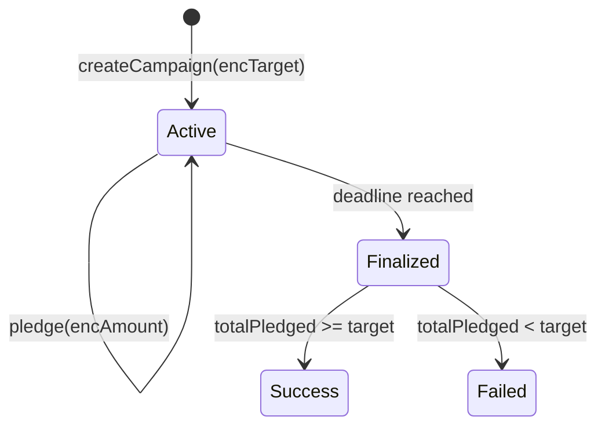

# Private Crowdfunding

> Confidential crowdfunding campaign with encrypted targets and pledges

## Overview

This example demonstrates how to implement **Private Crowdfunding** using FHEVM.

| Property | Value |
|----------|-------|
| **Level** | 🟡 Intermediate |
| **Category** | applications |
| **Key** | `private-crowdfunding` |

## 💰 Confidential Fundraising

Keep campaign targets and individual contributions private to:
- Prevent front-running or manipulation
- Protect contributor privacy
- Allow fair participation without social pressure

## 📊 Campaign Flow



## 🧠 Key FHE Concepts Used

- `FHE.add for encrypted accumulation`
- `FHE.ge for threshold checking`
- `Time-locked encrypted state`

## 📝 Contract Implementation

`contracts/PrivateCrowdfunding.sol`

```solidity
// SPDX-License-Identifier: BSD-3-Clause-Clear
pragma solidity ^0.8.24;

import "@fhevm/solidity/lib/FHE.sol";
import "encrypted-types/EncryptedTypes.sol";
import { ZamaEthereumConfig } from "@fhevm/solidity/config/ZamaConfig.sol";

contract PrivateCrowdfunding is ZamaEthereumConfig {
    address public owner;

    modifier onlyOwner() {
        require(msg.sender == owner, "Not owner");
        _;
    }

    struct Campaign {
        address creator;
        euint64 targetAmount;
        euint64 totalPledged;
        uint256 deadline;
        bool isFinalized;
    }

    mapping(uint256 => Campaign) public campaigns;
    uint256 public campaignCount;

    // campaignId => user => encrypted pledge amount
    mapping(uint256 => mapping(address => euint64)) public pledges;

    event CampaignCreated(uint256 indexed campaignId, address creator, uint256 deadline);
    event Pledged(uint256 indexed campaignId, address contributor);
    event CampaignFinalized(uint256 indexed campaignId);

    constructor() {
        owner = msg.sender;
    }

    function createCampaign(externalEuint64 _encryptedTarget, bytes calldata _inputProof, uint256 _duration) public {
        campaignCount++;
        Campaign storage c = campaigns[campaignCount];
        c.creator = msg.sender;
        c.targetAmount = FHE.fromExternal(_encryptedTarget, _inputProof);
        FHE.allowThis(c.targetAmount);
        
        c.totalPledged = FHE.asEuint64(0);
        FHE.allowThis(c.totalPledged);
        c.deadline = block.timestamp + _duration;
        
        emit CampaignCreated(campaignCount, msg.sender, c.deadline);
    }

    function pledge(uint256 _campaignId, externalEuint64 _encryptedAmount, bytes calldata _inputProof) public {
        Campaign storage c = campaigns[_campaignId];
        require(block.timestamp < c.deadline, "Campaign ended");
        
        euint64 amount = FHE.fromExternal(_encryptedAmount, _inputProof);
        FHE.allowThis(amount);
        
        // Update user pledge
        if (!FHE.isInitialized(pledges[_campaignId][msg.sender])) {
             pledges[_campaignId][msg.sender] = amount;
             FHE.allowThis(pledges[_campaignId][msg.sender]);
        } else {
             pledges[_campaignId][msg.sender] = FHE.add(pledges[_campaignId][msg.sender], amount);
             FHE.allowThis(pledges[_campaignId][msg.sender]);
        }
        
        // Update total
        c.totalPledged = FHE.add(c.totalPledged, amount);
        FHE.allowThis(c.totalPledged);

        emit Pledged(_campaignId, msg.sender);
    }

    function finalizeCampaign(uint256 _campaignId) public {
        Campaign storage c = campaigns[_campaignId];
        require(block.timestamp >= c.deadline, "Campaign ongoing");
        require(!c.isFinalized, "Already finalized");

        // Check if totalPledged >= targetAmount
        ebool reached = FHE.ge(c.totalPledged, c.targetAmount);
        
        // Allow the Creator to see the results
        FHE.allow(c.totalPledged, c.creator);
        FHE.allow(c.targetAmount, c.creator);
        FHE.allow(reached, c.creator);
        
        c.isFinalized = true;
        
        emit CampaignFinalized(_campaignId);
    }
}

```

## 🧪 Test Suite

`test/PrivateCrowdfunding.ts`

```typescript
import { expect } from "chai";
import { ethers, fhevm } from "hardhat";
import { PrivateCrowdfunding } from "../../types";
import { HardhatEthersSigner } from "@nomicfoundation/hardhat-ethers/signers";

describe("PrivateCrowdfunding", function () {
    let contract: PrivateCrowdfunding;
    let contractAddress: string;
    let signers: { deployer: HardhatEthersSigner; creator: HardhatEthersSigner; backer1: HardhatEthersSigner };

    before(async function () {
        const ethSigners = await ethers.getSigners();
        signers = {
            deployer: ethSigners[0],
            creator: ethSigners[1],
            backer1: ethSigners[2],
        };
    });

    beforeEach(async function () {
        if (!fhevm.isMock) {
            this.skip();
        }
        const factory = await ethers.getContractFactory("PrivateCrowdfunding");
        contract = (await factory.deploy()) as PrivateCrowdfunding;
        contractAddress = await contract.getAddress();
    });

    it("should allow creating a campaign and pledging funds", async function () {
        // 1. Create Campaign (Target: 1000, Duration: 1 day)
        const target = 1000;
        const duration = 86400;

        const encTarget = await fhevm.createEncryptedInput(contractAddress, signers.creator.address)
            .add64(target)
            .encrypt();

        await contract.connect(signers.creator).createCampaign(
            encTarget.handles[0],
            encTarget.inputProof,
            duration
        );

        const campaignId = 1;

        // 2. Pledge (Backer1 pledges 500)
        const pledgeAmount = 500;
        const encPledge = await fhevm.createEncryptedInput(contractAddress, signers.backer1.address)
            .add64(pledgeAmount)
            .encrypt();

        await contract.connect(signers.backer1).pledge(
            campaignId,
            encPledge.handles[0],
            encPledge.inputProof
        );

        // 3. Fast forward and finalize
        await ethers.provider.send("evm_increaseTime", [duration + 1]);
        await ethers.provider.send("evm_mine", []);

        await contract.connect(signers.creator).finalizeCampaign(campaignId);

        const c = await contract.campaigns(campaignId);
        expect(c.isFinalized).to.be.true;
    });
});

```

## 🚀 Quick Start

Generate this example locally:

```bash
# Using npx (no install)
npx jobjab-fhevm-examples private-crowdfunding ./my-private-crowdfunding

# Or with the CLI
npm run create private-crowdfunding ./my-private-crowdfunding
```

Then build and test:

```bash
cd ./my-private-crowdfunding
npm install
npm run compile
npm run test
```

---
*Generated by FHEVM Example Hub*
