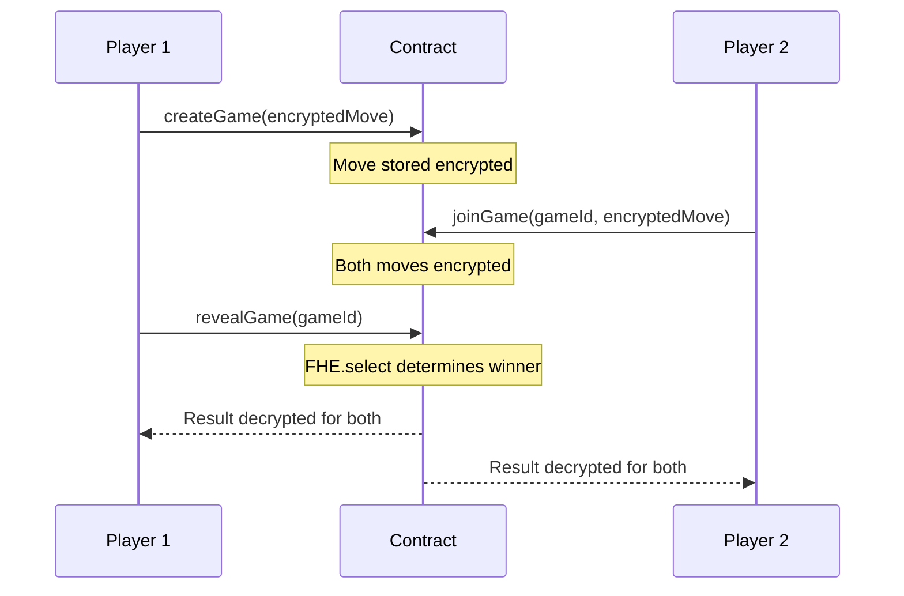

# Rock Paper Scissors

> Two-player encrypted Rock Paper Scissors game

## Overview

This example demonstrates how to implement **Rock Paper Scissors** using FHEVM.

| Property | Value |
|----------|-------|
| **Level** | 🟡 Intermediate |
| **Category** | applications |
| **Key** | `rock-paper-scissors` |

## 🎮 How It Works

This game uses FHE to keep player moves secret until both players have committed:

1. **Player 1 creates a game** with an encrypted move (Rock=1, Paper=2, Scissors=3)
2. **Player 2 joins** with their own encrypted move
3. **Reveal phase** determines winner using encrypted comparisons

## 📊 Game Flow



## 🧠 Key FHE Concepts Used

- `FHE.select for conditional logic`
- `FHE.eq/and/or for encrypted comparisons`
- `Multi-party encrypted state`

## 📝 Contract Implementation

`contracts/RockPaperScissors.sol`

```solidity
// SPDX-License-Identifier: BSD-3-Clause-Clear
pragma solidity ^0.8.24;

import "@fhevm/solidity/lib/FHE.sol";
import "encrypted-types/EncryptedTypes.sol";
import { ZamaEthereumConfig } from "@fhevm/solidity/config/ZamaConfig.sol";

contract RockPaperScissors is ZamaEthereumConfig {
    address public owner;

    modifier onlyOwner() {
        require(msg.sender == owner, "Not owner");
        _;
    }

    // 1 = Rock, 2 = Paper, 3 = Scissors
    euint8 private ROCK;
    euint8 private PAPER;
    euint8 private SCISSORS;

    struct Game {
        address player1;
        address player2;
        euint8 move1;
        euint8 move2;
        bool isFinished;
    }

    mapping(uint256 => Game) public games;
    uint256 public gameCount;

    event GameCreated(uint256 indexed gameId, address player1);
    event GameJoined(uint256 indexed gameId, address player2);
    event GameFinished(uint256 indexed gameId);

    constructor() {
        owner = msg.sender;
        ROCK = FHE.asEuint8(1);
        PAPER = FHE.asEuint8(2);
        SCISSORS = FHE.asEuint8(3);
        
        // Grant contract permission to use these constants
        FHE.allowThis(ROCK);
        FHE.allowThis(PAPER);
        FHE.allowThis(SCISSORS);
    }

    function createGame(externalEuint8 _encryptedMove, bytes calldata _inputProof) public {
        gameCount++;
        Game storage g = games[gameCount];
        g.player1 = msg.sender;
        
        g.move1 = FHE.fromExternal(_encryptedMove, _inputProof);
        FHE.allowThis(g.move1);
        FHE.allow(g.move1, msg.sender);

        emit GameCreated(gameCount, msg.sender);
    }

    function joinGame(uint256 _gameId, externalEuint8 _encryptedMove, bytes calldata _inputProof) public {
        Game storage g = games[_gameId];
        require(g.player1 != address(0), "Game does not exist");
        require(g.player2 == address(0), "Game full");
        require(msg.sender != g.player1, "Cannot play against yourself");

        g.player2 = msg.sender;
        g.move2 = FHE.fromExternal(_encryptedMove, _inputProof);
        FHE.allowThis(g.move2);
        FHE.allow(g.move2, msg.sender);

        emit GameJoined(_gameId, msg.sender);
    }

    function revealGame(uint256 _gameId) public {
        Game storage g = games[_gameId];
        require(msg.sender == g.player1 || msg.sender == g.player2, "Only players can reveal");
        require(g.player2 != address(0), "Game not full");
        require(!g.isFinished, "Game already finished");

        // Logic to determine winner
        // Winner is 0 for TIE, 1 for Player1, 2 for Player2
        
        ebool p1Wins = FHE.or(
            FHE.and(FHE.eq(g.move1, ROCK), FHE.eq(g.move2, SCISSORS)), // Rock beats Scissors
            FHE.or(
                FHE.and(FHE.eq(g.move1, PAPER), FHE.eq(g.move2, ROCK)), // Paper beats Rock
                FHE.and(FHE.eq(g.move1, SCISSORS), FHE.eq(g.move2, PAPER)) // Scissors beats Paper
            )
        );

        ebool p2Wins = FHE.or(
            FHE.and(FHE.eq(g.move2, ROCK), FHE.eq(g.move1, SCISSORS)),
            FHE.or(
                FHE.and(FHE.eq(g.move2, PAPER), FHE.eq(g.move1, ROCK)),
                FHE.and(FHE.eq(g.move2, SCISSORS), FHE.eq(g.move1, PAPER))
            )
        );

        // euint8 result: 0=Tie, 1=P1, 2=P2
        euint8 res = FHE.select(p1Wins, FHE.asEuint8(1), FHE.asEuint8(0));
        res = FHE.select(p2Wins, FHE.asEuint8(2), res);

        // Allow both players to decrypt the result
        FHE.allow(res, g.player1);
        FHE.allow(res, g.player2);
        
        FHE.allow(g.move1, g.player2); // Reveal moves to each other
        FHE.allow(g.move2, g.player1);
        
        g.isFinished = true;
        
        emit GameFinished(_gameId);
    }
}

```

## 🧪 Test Suite

`test/RockPaperScissors.ts`

```typescript
import { expect } from "chai";
import { ethers, fhevm } from "hardhat";
import { RockPaperScissors } from "../../types";
import { HardhatEthersSigner } from "@nomicfoundation/hardhat-ethers/signers";

describe("RockPaperScissors", function () {
    let contract: RockPaperScissors;
    let contractAddress: string;
    let signers: { deployer: HardhatEthersSigner; alice: HardhatEthersSigner; bob: HardhatEthersSigner };

    before(async function () {
        const ethSigners = await ethers.getSigners();
        signers = {
            deployer: ethSigners[0],
            alice: ethSigners[1],
            bob: ethSigners[2],
        };
    });

    beforeEach(async function () {
        if (!fhevm.isMock) {
            this.skip();
        }
        const factory = await ethers.getContractFactory("RockPaperScissors");
        contract = (await factory.deploy()) as RockPaperScissors;
        contractAddress = await contract.getAddress();
    });

    it("should allow a full game flow (Alice Rock vs Bob Scissors -> Alice Wins)", async function () {
        // 1. Alice creates game with Rock (1)
        const encMoveAlice = await fhevm.createEncryptedInput(contractAddress, signers.alice.address)
            .add8(1)
            .encrypt();

        await contract.connect(signers.alice).createGame(
            encMoveAlice.handles[0],
            encMoveAlice.inputProof
        );

        // 2. Bob joins with Scissors (3)
        const encMoveBob = await fhevm.createEncryptedInput(contractAddress, signers.bob.address)
            .add8(3)
            .encrypt();

        await contract.connect(signers.bob).joinGame(
            1, // gameId
            encMoveBob.handles[0],
            encMoveBob.inputProof
        );

        // 3. Reveal
        await contract.connect(signers.alice).revealGame(1);

        const game = await contract.games(1);
        expect(game.isFinished).to.be.true;
    });
});

```

## 🚀 Quick Start

Generate this example locally:

```bash
# Using npx (no install)
npx jobjab-fhevm-examples rock-paper-scissors ./my-rock-paper-scissors

# Or with the CLI
npm run create rock-paper-scissors ./my-rock-paper-scissors
```

Then build and test:

```bash
cd ./my-rock-paper-scissors
npm install
npm run compile
npm run test
```

---
*Generated by FHEVM Example Hub*
