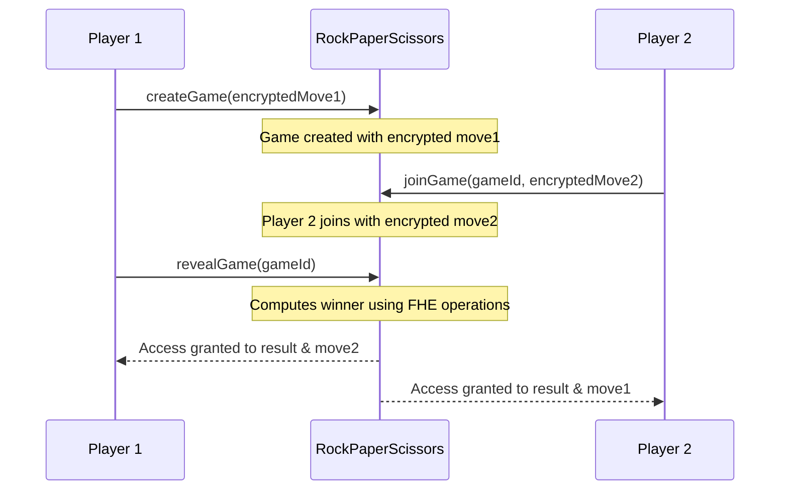

# Rock Paper Scissors

A classic game implemented with FHE encryption, where players can submit their moves confidentially without revealing them until the game is resolved.

## Overview

In traditional blockchain games, all data is public, making it impossible to keep moves secret. With FHEVM, players can submit encrypted moves (Rock, Paper, or Scissors) that remain hidden until both players have committed. The contract then determines the winner using encrypted comparisons without ever revealing individual moves to observers.

## Key FHE Concepts

- **Encrypted Inputs (`externalEuint8`)**: Players submit their encrypted moves (1=Rock, 2=Paper, 3=Scissors).
- **Encrypted Comparison (`FHE.eq`)**: Used to check equality between encrypted moves and constants.
- **Encrypted Logic (`FHE.and`, `FHE.or`)**: Used to combine conditions for determining the winner.
- **Conditional Selection (`FHE.select`)**: Returns different values based on an encrypted boolean condition.
- **Access Control (`FHE.allow`)**: Grants specific players permission to decrypt the result.

## Contract Architecture

### State Variables

- `ROCK`, `PAPER`, `SCISSORS`: Encrypted constants representing the three moves.
- `games`: Mapping storing game state for each game ID.

### Structs

- `Game`: Contains player addresses, encrypted moves, and game status.

### Functions

- `createGame(externalEuint8 _encryptedMove, bytes calldata _inputProof)`: Player 1 creates a new game with their encrypted move.
- `joinGame(uint256 _gameId, externalEuint8 _encryptedMove, bytes calldata _inputProof)`: Player 2 joins an existing game with their encrypted move.
- `revealGame(uint256 _gameId)`: Either player can call this to determine the winner. The result is encrypted and only accessible to both players.

## Game Flow



## Winner Determination Logic

The contract determines the winner using boolean FHE logic:

```solidity
// Player 1 wins if:
// - P1 plays Rock AND P2 plays Scissors
// - P1 plays Paper AND P2 plays Rock
// - P1 plays Scissors AND P2 plays Paper

ebool p1Wins = FHE.or(
    FHE.and(FHE.eq(g.move1, ROCK), FHE.eq(g.move2, SCISSORS)),
    FHE.or(
        FHE.and(FHE.eq(g.move1, PAPER), FHE.eq(g.move2, ROCK)),
        FHE.and(FHE.eq(g.move1, SCISSORS), FHE.eq(g.move2, PAPER))
    )
);

// Result: 0=Tie, 1=Player1 wins, 2=Player2 wins
euint8 res = FHE.select(p1Wins, FHE.asEuint8(1), FHE.asEuint8(0));
res = FHE.select(p2Wins, FHE.asEuint8(2), res);
```

## Security Considerations

- **Move Commitment**: Once a move is submitted, it cannot be changed.
- **Fair Play**: Neither player can see the other's move until both have committed.
- **Result Privacy**: Only the two players can decrypt the game result and each other's moves.

## Extensions

- **Staking**: Add ETH or ERC20 token stakes to make the game more competitive.
- **Multiple Rounds**: Extend to best-of-3 or best-of-5 matches.
- **Tournament Mode**: Create brackets for multiple players.
