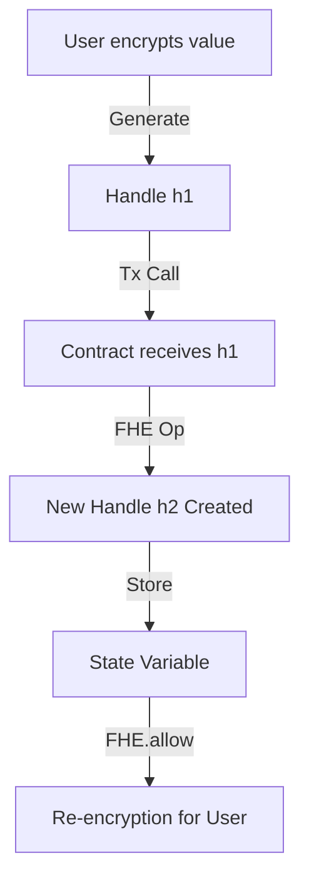

# Handles Lifecycle

> Explains the concept of FHE handles and their lifecycle

## Overview

This example demonstrates how to implement **Handles Lifecycle** using FHEVM.

- **Level:** 🔴 Advanced
- **Category:** concepts

## 📊 Lifecycle Visualization



## 📝 Contract Implementation

`contracts/HandleExample.sol`

```solidity
// SPDX-License-Identifier: BSD-3-Clause-Clear
pragma solidity ^0.8.24;

import { FHE, euint32, externalEuint32 } from "@fhevm/solidity/lib/FHE.sol";
import { ZamaEthereumConfig } from "@fhevm/solidity/config/ZamaConfig.sol";

/// @title Handle Lifecycle Example
/// @notice Demonstrates how FHE handles work under the hood.
contract HandleExample is ZamaEthereumConfig {
    euint32 private _storedValue;

    constructor() {
        _storedValue = FHE.asEuint32(0);
        FHE.allowThis(_storedValue);
    }

    /// @notice Returns the raw handle ID for the stored value.
    /// @dev Handles are just uint256 identifiers pointing to data in the Coprocessor/Validator memory.
    function getHandle() external view returns (uint256) {
        return uint256(euint32.unwrap(_storedValue));
    }

    /// @notice Demonstrates that operations produce NEW handles.
    /// @return originalHandle The handle of the input.
    /// @return newHandle The handle of the result (different).
    function compareHandles(externalEuint32 input, bytes calldata inputProof) 
        external 
        returns (uint256 originalHandle, uint256 newHandle) 
    {
        euint32 val = FHE.fromExternal(input, inputProof);
        FHE.allowThis(val);
        
        euint32 res = FHE.add(val, FHE.asEuint32(1));
        FHE.allowThis(res);

        return (uint256(euint32.unwrap(val)), uint256(euint32.unwrap(res)));
    }
}


```

## 🧪 Test Suite

`test/HandleExample.ts`

```typescript
import { HardhatEthersSigner } from "@nomicfoundation/hardhat-ethers/signers";
import { ethers, fhevm } from "hardhat";
import { HandleExample } from "../../types";
import { expect } from "chai";

describe("HandleExample", function () {
  let signers: { deployer: HardhatEthersSigner };
  let contract: HandleExample;
  let contractAddress: string;

  before(async function () {
    const ethSigners = await ethers.getSigners();
    signers = { deployer: ethSigners[0] };
  });

  beforeEach(async function () {
    const factory = await ethers.getContractFactory("HandleExample");
    contract = (await factory.deploy()) as HandleExample;
    contractAddress = await contract.getAddress();
  });

  /**
   * @chapter concepts
   * @example handles
   * @summary Explains FHE handles and their lifecycle.
   * 
   * # Handle Lifecycle Diagram
   * 
   * ```mermaid
   * graph TD
   *   A[User Encrypts Data] -->|createEncryptedInput| B(Input Handle)
   *   B -->|FHE.fromExternal| C{Smart Contract}
   *   C -->|FHE.add| D(New Result Handle)
   *   C -->|FHE.allow| E[Permission Added]
   *   D -->|reencrypt| F[User Decrypts]
   * ```
   */
  it("should generate new handles for operations", async function () {
    const input = await fhevm.createEncryptedInput(contractAddress, signers.deployer.address)
        .add32(10)
        .encrypt();

    // Call contract
    // We can't easily get return values from non-view functions in Ethers v6 without staticCall or events.
    // Using staticCall to check return values
    const [h1, h2] = await contract.compareHandles.staticCall(input.handles[0], input.inputProof);
    
    // Actually execute state change (though not needed for this check, good practice)
    await contract.compareHandles(input.handles[0], input.inputProof);

    // Handles should be different numbers
    expect(h1).to.not.equal(h2);
    console.log("Input Handle:", h1.toString());
    console.log("Result Handle:", h2.toString());
  });
});

```

## Usage

To generate this example locally:

```bash
npm run create handles ./my-handles
```

Then run tests:

```bash
cd ./my-handles
npm install
npm run compile
npm run test
```

---
Generated by FHEVM Example Hub
