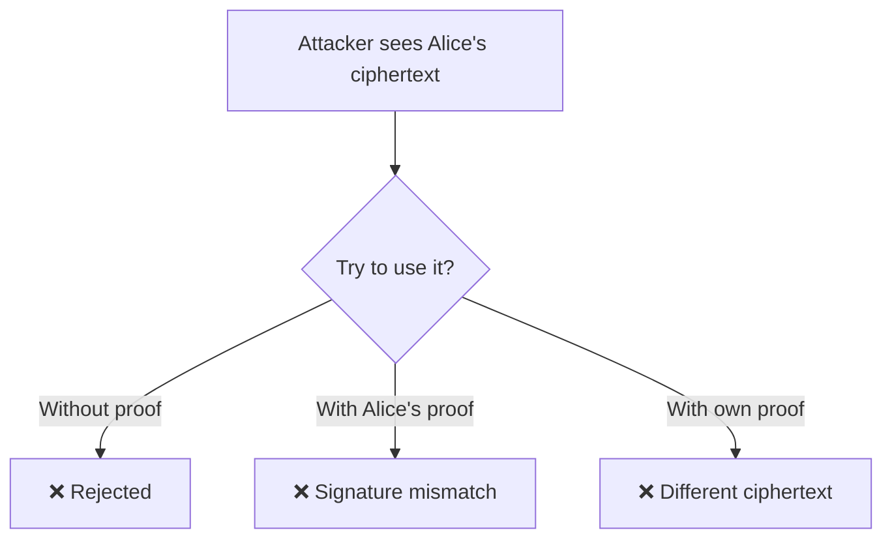

# Input Proofs

> Shows correct usage of input proofs to prevent malling

## Overview

This example demonstrates how to implement **Input Proofs** using FHEVM.

| Property | Value |
|----------|-------|
| **Level** | 🔴 Advanced |
| **Category** | concepts |
| **Key** | `input-proofs` |

## 🛡️ Why Input Proofs Matter

Input proofs prevent **ciphertext mauling attacks**:



## 🔑 The Proof Binds:

1. **Ciphertext** to **Contract Address**
2. **Ciphertext** to **Sender Address**

## 🧠 Key FHE Concepts Used

- `FHE.fromExternal validation`
- `Proof binding mechanism`
- `Anti-mauling protection`

## 📝 Contract Implementation

`contracts/InputProofExample.sol`

```solidity
// SPDX-License-Identifier: BSD-3-Clause-Clear
pragma solidity ^0.8.24;

import { FHE, euint32, externalEuint32 } from "@fhevm/solidity/lib/FHE.sol";
import { ZamaEthereumConfig } from "@fhevm/solidity/config/ZamaConfig.sol";

/// @title Input Proof Example
/// @notice Demonstrates correct usage of Input Proofs to prevent Ciphertext Malling.
/// @dev In FHE, it is crucial to verify that the sender knows the plaintext of the ciphertext they are submitting.
/// This prevents "Malling" attacks where an attacker copies a ciphertext from another user/transaction
/// and submits it as their own, potentially tricking the contract.
/// FHE.fromExternal() automatically verifies this proof against the msg.sender.
contract InputProofExample is ZamaEthereumConfig {
    euint32 private _userValue;

    /// @notice Sets a value using an input proof.
    /// @dev The `inputProof` is cryptographically bound to `msg.sender` and the `input` ciphertext.
    /// If an attacker intercepts the `input` and tries to call this function, the proof verification will fail
    /// because the proof was signed by the original sender, not the attacker (unless they are the same).
    function setValue(externalEuint32 input, bytes calldata inputProof) external {
        // This function call will revert if the proof is invalid or not for msg.sender
        _userValue = FHE.fromExternal(input, inputProof);
        FHE.allowThis(_userValue);
    }
    
    function getValue() external view returns (euint32) {
        return _userValue;
    }
}


```

## 🧪 Test Suite

`test/InputProofExample.ts`

```typescript
import { HardhatEthersSigner } from "@nomicfoundation/hardhat-ethers/signers";
import { ethers, fhevm } from "hardhat";
import { InputProofExample, InputProofExample__factory } from "../../types";
import { expect } from "chai";

async function deployFixture() {
  const factory = (await ethers.getContractFactory("InputProofExample")) as InputProofExample__factory;
  const contract = (await factory.deploy()) as InputProofExample;
  const contractAddress = await contract.getAddress();
  return { contract, contractAddress };
}

describe("InputProofExample", function () {
  let signers: { deployer: HardhatEthersSigner; alice: HardhatEthersSigner; mallory: HardhatEthersSigner };
  let contract: InputProofExample;
  let contractAddress: string;

  before(async function () {
    const ethSigners = await ethers.getSigners();
    signers = { deployer: ethSigners[0], alice: ethSigners[1], mallory: ethSigners[2] };
  });

  beforeEach(async function () {
    if (!fhevm.isMock) {
      this.skip();
    }
    ({ contract, contractAddress } = await deployFixture());
  });

  it("should accept valid input proof from alice", async function () {
    const input = await fhevm.createEncryptedInput(contractAddress, signers.alice.address)
      .add32(123)
      .encrypt();
    
    await expect(contract.connect(signers.alice).setValue(input.handles[0], input.inputProof))
      .to.not.be.reverted;
  });

  it("should reject input proof if sent by mallory (Front-running/Replay attack simulation)", async function () {
    // Alice generates a valid input and proof
    const input = await fhevm.createEncryptedInput(contractAddress, signers.alice.address)
      .add32(123)
      .encrypt();

    // Mallory sees this in the mempool and tries to use it herself
    // If signers.mallory calls the contract, FHE.fromExternal checks if proof matches msg.sender.
    
    // Expect revert (Checking general revert as the exact message might depend on mock impl)
    await expect(contract.connect(signers.mallory).setValue(input.handles[0], input.inputProof))
      .to.be.reverted;
  });
});


```

## 🚀 Quick Start

Generate this example locally:

```bash
# Using npx (no install)
npx jobjab-fhevm-examples input-proofs ./my-input-proofs

# Or with the CLI
npm run create input-proofs ./my-input-proofs
```

Then build and test:

```bash
cd ./my-input-proofs
npm install
npm run compile
npm run test
```

---
*Generated by FHEVM Example Hub*
