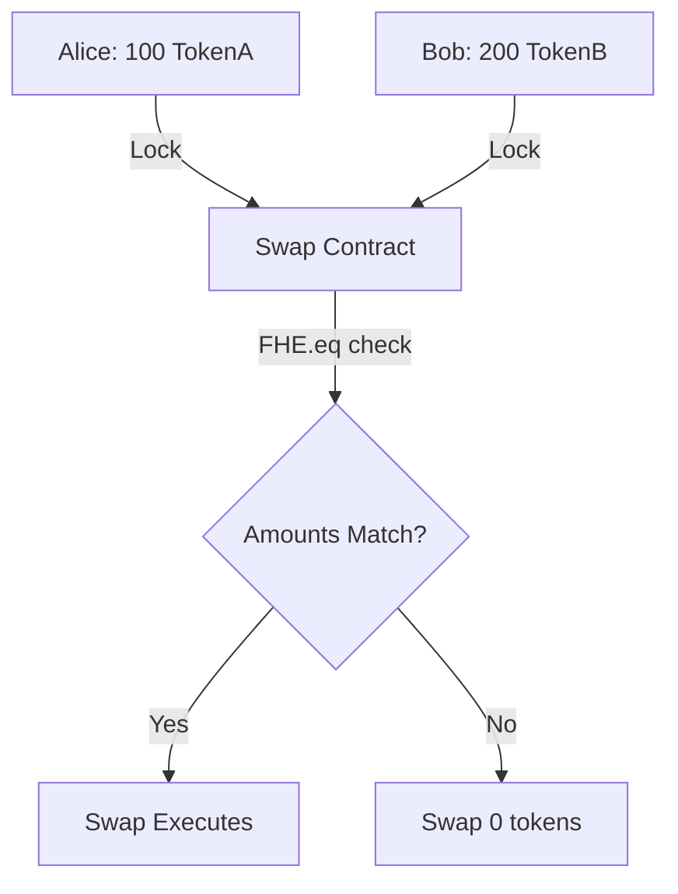

# Swap ERC7984 <-> ERC7984

> Atomic swap between two confidential ERC7984 tokens

## Overview

This example demonstrates how to implement **Swap ERC7984 <-> ERC7984** using FHEVM.

| Property | Value |
|----------|-------|
| **Level** | 🟡 Intermediate |
| **Category** | openzeppelin |
| **Key** | `erc7984-erc7984-swap` |

## 🔄 Fully Private Atomic Swap

Both sides of the trade remain confidential:



## 💡 Key Feature

Amounts are verified with `FHE.eq` - if they don't match the expected, the swap transfers nothing.

## 🧠 Key FHE Concepts Used

- `FHE.eq for amount matching`
- `Conditional swap with select`
- `Fully encrypted OTC trades`

## 📝 Contract Implementation

`contracts/SwapERC7984ERC7984.sol`

```solidity
// SPDX-License-Identifier: BSD-3-Clause-Clear
pragma solidity ^0.8.24;

import { ERC7984 } from "@openzeppelin/confidential-contracts/token/ERC7984/ERC7984.sol";
import { IERC7984 } from "@openzeppelin/confidential-contracts/interfaces/IERC7984.sol";
import { ZamaEthereumConfig } from "@fhevm/solidity/config/ZamaConfig.sol";
import { FHE, euint64, externalEuint64, ebool } from "@fhevm/solidity/lib/FHE.sol";

/// @title Swap ERC7984 <-> ERC7984
/// @notice Atomic swap between two confidential ERC7984 tokens with hidden amounts.
contract SwapERC7984ERC7984 is ZamaEthereumConfig {
    IERC7984 public tokenA;
    IERC7984 public tokenB;

    struct Order {
        address maker;
        euint64 amountA;      // Amount offered by Maker
        euint64 askAmountB;   // Amount requested from Taker
        bool active;
    }
    
    mapping(uint256 => Order) public orders;
    uint256 public nextOrderId;

    event OrderCreated(uint256 indexed orderId, address indexed maker);
    event OrderFilled(uint256 indexed orderId, address indexed taker);

    constructor(address _tokenA, address _tokenB) {
        tokenA = IERC7984(_tokenA);
        tokenB = IERC7984(_tokenB);
    }

    /// @notice Maker creates an order
    /// @param encryptedAmountA Amount of Token A to sell
    /// @param encryptedAskAmountB Amount of Token B required
    function createOrder(
        externalEuint64 encryptedAmountA, 
        bytes calldata proofA,
        externalEuint64 encryptedAskAmountB,
        bytes calldata proofB
    ) external {
        euint64 amountA = FHE.fromExternal(encryptedAmountA, proofA);
        euint64 askAmountB = FHE.fromExternal(encryptedAskAmountB, proofB);
        
        // Lock Token A from Maker
        FHE.allow(amountA, address(tokenA));
        tokenA.confidentialTransferFrom(msg.sender, address(this), amountA);
        
        orders[nextOrderId] = Order({
            maker: msg.sender,
            amountA: amountA,
            askAmountB: askAmountB,
            active: true
        });
        
        // Allow contract to manage these handles
        FHE.allowThis(orders[nextOrderId].amountA);
        FHE.allowThis(orders[nextOrderId].askAmountB);

        emit OrderCreated(nextOrderId, msg.sender);
        nextOrderId++;
    }

    /// @notice Taker fills the order
    /// @param encryptedAmountB Amount of Token B sending
    function fillOrder(uint256 orderId, externalEuint64 encryptedAmountB, bytes calldata proofB) external {
        Order storage order = orders[orderId];
        require(order.active, "Order not active");
        
        euint64 amountB = FHE.fromExternal(encryptedAmountB, proofB);

        // Check if Taker sent enough Token B
        ebool isEnough = FHE.eq(amountB, order.askAmountB);
        
        // Conditional swap based on amount check
        euint64 zero = FHE.asEuint64(0);
        
        // If enough, transfer amountB; else transfer 0
        euint64 amountBToTransfer = FHE.select(isEnough, amountB, zero);
        
        // If enough, transfer amountA; else transfer 0
        euint64 amountAToTransfer = FHE.select(isEnough, order.amountA, zero);

        // Lock Token B from Taker (transfer conditional amount)
        FHE.allow(amountBToTransfer, address(tokenB));
        tokenB.confidentialTransferFrom(msg.sender, address(this), amountBToTransfer);
        
        // Swap:
        // Token A -> Taker
        FHE.allow(amountAToTransfer, address(tokenA));
        tokenA.confidentialTransfer(msg.sender, amountAToTransfer);
        
        // Token B -> Maker
        FHE.allow(amountBToTransfer, address(tokenB));
        tokenB.confidentialTransfer(order.maker, amountBToTransfer);
        
        order.active = false;
        emit OrderFilled(orderId, msg.sender);
    }
}

contract MockConfidentialToken is ERC7984, ZamaEthereumConfig {
    constructor() ERC7984("Mock Private", "PRIV", "") {}
    function mint(address to, uint64 amount) public { _mint(to, FHE.asEuint64(amount)); }
}


```

## 🧪 Test Suite

`test/SwapERC7984ERC7984.ts`

```typescript
import { HardhatEthersSigner } from "@nomicfoundation/hardhat-ethers/signers";
import { ethers, fhevm } from "hardhat";
import { SwapERC7984ERC7984, MockConfidentialToken } from "../../types";
import { expect } from "chai";
import { FhevmType } from "@fhevm/hardhat-plugin";

describe("SwapERC7984ERC7984", function () {
  let signers: { deployer: HardhatEthersSigner; alice: HardhatEthersSigner; bob: HardhatEthersSigner };
  let swapContract: SwapERC7984ERC7984;
  let tokenA: MockConfidentialToken;
  let tokenB: MockConfidentialToken;
  let swapAddress: string;
  let tokenAAddress: string;
  let tokenBAddress: string;

  before(async function () {
    const ethSigners = await ethers.getSigners();
    signers = { deployer: ethSigners[0], alice: ethSigners[1], bob: ethSigners[2] };
  });

  beforeEach(async function () {
    // Deploy Tokens
    const confFactory = await ethers.getContractFactory("MockConfidentialToken");

    tokenA = (await confFactory.deploy()) as MockConfidentialToken;
    tokenAAddress = await tokenA.getAddress();

    tokenB = (await confFactory.deploy()) as MockConfidentialToken;
    tokenBAddress = await tokenB.getAddress();

    // Deploy Swap
    const swapFactory = await ethers.getContractFactory("SwapERC7984ERC7984");
    swapContract = (await swapFactory.deploy(tokenAAddress, tokenBAddress)) as SwapERC7984ERC7984;
    swapAddress = await swapContract.getAddress();
  });

  /**
   * @chapter openzeppelin
   * @example erc7984-erc7984-swap
   * @summary Private atomic swap between two confidential ERC7984 tokens.
   */
  it("should swap confidential tokens when amounts match", async function () {
    const amountA = 100;
    const amountB = 200;

    // Alice has Token A
    await tokenA.mint(signers.alice.address, amountA);
    await tokenA.connect(signers.alice).setOperator(swapAddress, "281474976710655");

    // Bob has Token B
    await tokenB.mint(signers.bob.address, amountB);
    await tokenB.connect(signers.bob).setOperator(swapAddress, "281474976710655");

    // Alice creates order: Offer 100 A, Ask 200 B
    const inputA = await fhevm.createEncryptedInput(swapAddress, signers.alice.address)
      .add64(amountA)
      .encrypt();

    const inputAskB = await fhevm.createEncryptedInput(swapAddress, signers.alice.address)
      .add64(amountB)
      .encrypt();

    await swapContract.connect(signers.alice).createOrder(
      inputA.handles[0], inputA.inputProof,
      inputAskB.handles[0], inputAskB.inputProof
    );

    // Alice's balance A should be 0
    const aliceBalanceHandleA = await tokenA.confidentialBalanceOf(signers.alice.address);
    const aliceBalanceA = await fhevm.userDecryptEuint(FhevmType.euint64, aliceBalanceHandleA, tokenAAddress, signers.alice);
    expect(aliceBalanceA).to.equal(0);

    // Bob fills order: Sends 200 B
    const inputB = await fhevm.createEncryptedInput(swapAddress, signers.bob.address)
      .add64(amountB)
      .encrypt();

    await swapContract.connect(signers.bob).fillOrder(0, inputB.handles[0], inputB.inputProof);

    // Check Final Balances

    // Alice should have 200 Token B
    const aliceBalanceHandleB = await tokenB.confidentialBalanceOf(signers.alice.address);
    const aliceBalanceB = await fhevm.userDecryptEuint(FhevmType.euint64, aliceBalanceHandleB, tokenBAddress, signers.alice);
    expect(aliceBalanceB).to.equal(amountB);

    // Bob should have 100 Token A
    const bobBalanceHandleA = await tokenA.confidentialBalanceOf(signers.bob.address);
    const bobBalanceA = await fhevm.userDecryptEuint(FhevmType.euint64, bobBalanceHandleA, tokenAAddress, signers.bob);
    expect(bobBalanceA).to.equal(amountA);
  });

  it("should fail when amounts do not match", async function () {
    const amountA = 100;
    const askAmountB = 200;
    const wrongAmountB = 150;

    // Alice Setup
    await tokenA.mint(signers.alice.address, amountA);
    await tokenA.connect(signers.alice).setOperator(swapAddress, "281474976710655");

    const inputA = await fhevm.createEncryptedInput(swapAddress, signers.alice.address)
      .add64(amountA)
      .encrypt();
    const inputAskB = await fhevm.createEncryptedInput(swapAddress, signers.alice.address)
      .add64(askAmountB)
      .encrypt();

    await swapContract.connect(signers.alice).createOrder(
      inputA.handles[0], inputA.inputProof,
      inputAskB.handles[0], inputAskB.inputProof
    );

    // Bob Setup
    await tokenB.mint(signers.bob.address, wrongAmountB);
    await tokenB.connect(signers.bob).setOperator(swapAddress, "281474976710655");

    // Bob tries to fill with wrong amount
    const inputB = await fhevm.createEncryptedInput(swapAddress, signers.bob.address)
      .add64(wrongAmountB)
      .encrypt();

    // Should not revert, but swap effectively 0
    await swapContract.connect(signers.bob).fillOrder(0, inputB.handles[0], inputB.inputProof);

    // Check that balances did NOT change (Alice still has 0 A effective? No, A is locked in contract)
    // Alice balance A (in contract loop) -> should return to her? 
    // Wait, if swap fails (0 transfer), Alice's A is still in contract.
    // Example logic assumes usage of select closes order. 
    // Bob should have kept his Token B (transferred 0).

    // Check Bob Balance B: should be full 'wrongAmountB'
    const bobBalanceHandleB = await tokenB.confidentialBalanceOf(signers.bob.address);
    const bobBalanceB = await fhevm.userDecryptEuint(FhevmType.euint64, bobBalanceHandleB, tokenBAddress, signers.bob);
    expect(bobBalanceB).to.equal(wrongAmountB);
  });
});


```

## 🚀 Quick Start

Generate this example locally:

```bash
# Using npx (no install)
npx jobjab-fhevm-examples erc7984-erc7984-swap ./my-erc7984-erc7984-swap

# Or with the CLI
npm run create erc7984-erc7984-swap ./my-erc7984-erc7984-swap
```

Then build and test:

```bash
cd ./my-erc7984-erc7984-swap
npm install
npm run compile
npm run test
```

---
*Generated by FHEVM Example Hub*
